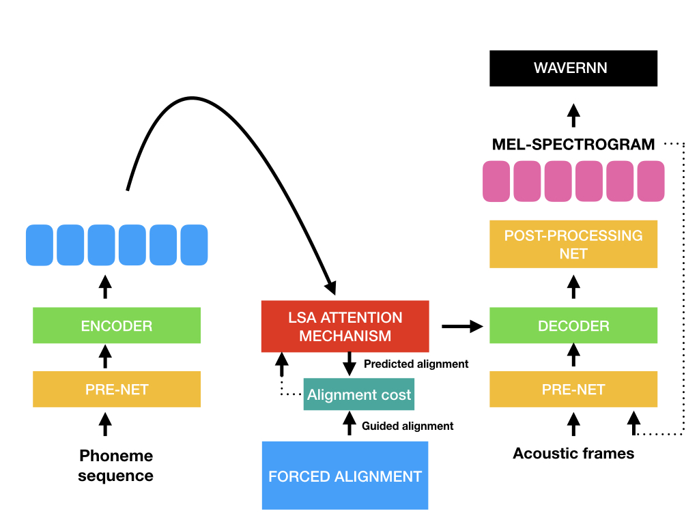

# Tacotron + WaveRNN

A modified version of [Fatchord/WaveRNN](https://github.com/fatchord/WaveRNN) repository , which implements a variant of the system described in Tacotron: Towards End-to-End Speech Synthesis. 

# Additions to original repo:

* Recipes for training Blizzard 2013 dataset (1, 2 or 4 books: JE, EM, LCL & FFM)
* Recipe to train model with pre-aligned guides as in [Pre-Alignment Guided Attention for Improving Training Efficiency and Model Stability
in End-to-End Speech Synthesis](https://ieeexplore.ieee.org/stamp/stamp.jsp?arnumber=8703406)

# Installation

Ensure you have:

* Python >= 3.6
* [Pytorch 1 with CUDA](https://pytorch.org/)

Install by creating a virtual environment using the following commands and install the the rest with pip:
> conda create -n taco python=3.6 anaconda

> conda install pytorch=1.0.1 torchvision cudatoolkit=8.0 -c pytorch

> pip install -r requirements.txt

# How to Use

### Quick Start

To test that everything is installed and working correctly run:

> python quick_start.py --hp_file hp_JE.py

This will generate everything in the default phonemes.txt file and synthesize wavs which are saved in the 'quick_start' folder

### Training your own Models

Download the [Blizzard Challenge 2013](http://www.cstr.ed.ac.uk/projects/blizzard/2013/lessac_blizzard2013/) Dataset.

In the same wav directory, make sure you have the corresponding transcription/metadata file which looks like this:

audio || text | phoneme sequence 

>CB-JE-01-59||but Eliza just put her head in at the door, and said at once "She is in the window-seat, to be sure, Jack."|<_START_> b ah t <> ih l ay z ax <> jh ah s t <> p uh t <> hh er <> hh eh d <> ih n <> ae t <> dh ax <> d ao r <,> ae n d <> s eh d <> ae t <> w ah n s <> sh iy <> ih z <> ih n <> dh ax <> w ih n d ow <> s iy t <,> t ax <> b iy <> sh uh r <,> jh ae k <.> <_END_>

1 - Edit hparams.py or create new hparams eg., hp_JE.py

Edit the following parameters accordingly in **hparams.py**:

          wav_path = 'data/wavs_train/'

          data_path = 'data/CB_JE'

          book_names = ['CB-JE']

          voc_model_id = 'blizzard_vocoder'

          tts_model_id = 'blizzard_baseline_JE'

          metadata = "train.csv"

2 - Next run the following to perform feature extraction:

> python preprocess.py --hp_file hp_JE.py

This extracts mels from wavs and dumps your linguistic features in a pickle file in the location specified by **data_path** in hparams.py.

To train the model:

3 - Train Tacotron using:

> python train_tacotron.py --hp_file hp_JE.py

4 - To generate from the model:

Edit the autogen.sh script:

> python test_taco_model_auto.py --checkpoint blizzard_baseline_JE.tacotron/taco_step300K_weights.pyt --model_name JE

This will generate the wavs using the test.txt phoneme sequences and save them in model_output.

# Recipes

[Recipe](PAG_recipe.md) to train model with pre-aligned guides 

# Pretrained Models

Currently there are 3 pretrained models available in the /pretrained/ folder':

Both are trained on Blizzard 2013:

* Tacotron trained using 1 book (JE) to 300k steps
* Tacotron trained using 4 books (that have wavs that have been carefully selected to control variability in speech rate) to 300k steps
* WaveRNN (Mixture of Logistics output) using LJSpeech trained to 800k steps (taken from original Fatchord/WaveRNN repo)

____

### References

* [Efficient Neural Audio Synthesis](https://arxiv.org/abs/1802.08435v1)
* [Tacotron: Towards End-to-End Speech Synthesis](https://arxiv.org/abs/1703.10135)
* [Natural TTS Synthesis by Conditioning WaveNet on Mel Spectrogram Predictions](https://arxiv.org/abs/1712.05884)
* [Pre-Alignment Guided Attention for Improving Training Efficiency and Model Stability
in End-to-End Speech Synthesis](https://ieeexplore.ieee.org/stamp/stamp.jsp?arnumber=8703406)

### Acknowlegements

* [https://github.com/fatchord/WaveRNN](https://github.com/fatchord/WaveRNN)
* Special thanks to the CSTR at the University of Edinburgh who I was working for at the time that this code is written

