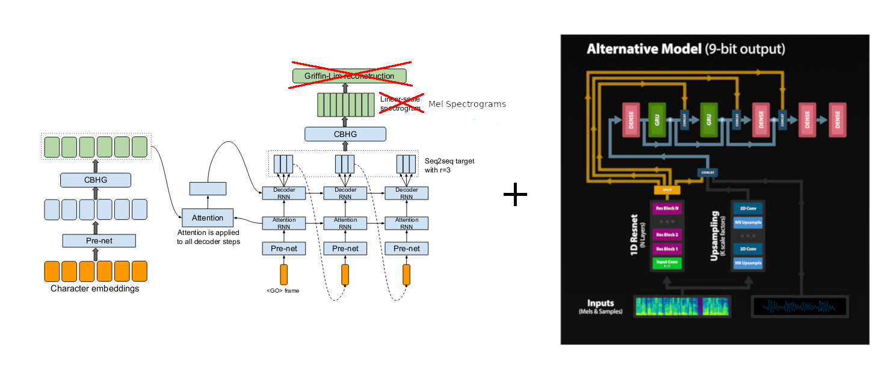

# Tacotron + WaveRNN

A modified version of Fatchord/WaveRNN repository, which implements a variant of the system described in Tacotron: Towards End-to-End Speech Synthesis. 

# Additions to original repo:

* Recipes for training Blizzard 2013 dataset (4 books: JE, EM, LCL & FFM)
* Generateding labels using HTK forced alignment
* Recipe to train model with pre-aligned guides as in [Pre-Alignment Guided Attention for Improving Training Efficiency and Model Stability
in End-to-End Speech Synthesis](https://ieeexplore.ieee.org/stamp/stamp.jsp?arnumber=8703406)
* Recipe to train model with diagonal guides as in [Efficiently Trainable Text-to-Speech System Based on Deep Convolutional Networks with Guided Attention](https://arxiv.org/abs/1710.08969)

Pytorch implementation of Deepmind's WaveRNN model from [Efficient Neural Audio Synthesis](https://arxiv.org/abs/1802.08435v1)

# Installation

Ensure you have:

* Python >= 3.6
* [Pytorch 1 with CUDA](https://pytorch.org/)

Then install the rest with pip:

> pip install -r requirements.txt

# How to Use

### Quick Start

If you want to use TTS functionality immediately you can simply use:

> python quick_start.py

This will generate everything in the default sentences.txt file and output to a new 'quick_start' folder where you can playback the wav files and take a look at the attention plots

You can also use that script to generate custom tts sentences and/or use '-u' to generate unbatched (better audio quality):

> python quick_start.py -u --input_text "What will happen if I run this command?"

### Training your own Models

Download the [Blizzard Challenge 2013](https://keithito.com/LJ-Speech-Dataset/) Dataset.

Edit **hparams.py**, point **wav_path** to your dataset and run:

> python preprocess.py --hp_file hp_JE.py

This extracts mels from wavs and dumps your linguistic features in a pickle file in the location specified by **datapath** in hparams.py.

To train the model:

1 - Train Tacotron using:

> python train_tacotron.py --hp_file hp_JE.py

2 - You can leave that to finish training or at any point you can use:

> python train_tacotron.py --force_gta

this will force tactron to create a GTA dataset even if it hasn't finish training.

3 - Train WaveRNN with:

> python train_wavernn.py --gta

NB: You can always just run train_wavernn.py without --gta if you're not interested in TTS.

4 - Generate Sentences with both models using:

> python gen_tacotron.py wavernn

this will generate default sentences. If you want generate custom sentences you can use

> python gen_tacotron.py --input_text "this is whatever you want it to be" wavernn

And finally, you can always use --help on any of those scripts to see what options are available :)

# Samples

[Can be found here.](https://fatchord.github.io/model_outputs/)

# Pretrained Models

Currently there are 2 pretrained models available in the /pretrained/ folder':

Both are trained on Blizzard 2013:

* Tacotron trained using 1 book (JE) to 200k steps
* Tacotron trained using 4 books (that have wavs that have been carefully selected to control variability in speech rate) to 200k steps

* WaveRNN (Mixture of Logistics output) using LJSpeech trained to 800k steps (taken from original Fatchord/WaveRNN repo)

____

### References

* [Efficient Neural Audio Synthesis](https://arxiv.org/abs/1802.08435v1)
* [Tacotron: Towards End-to-End Speech Synthesis](https://arxiv.org/abs/1703.10135)
* [Natural TTS Synthesis by Conditioning WaveNet on Mel Spectrogram Predictions](https://arxiv.org/abs/1712.05884)

### Acknowlegements

* [https://github.com/keithito/tacotron](https://github.com/keithito/tacotron)
* [https://github.com/r9y9/wavenet_vocoder](https://github.com/r9y9/wavenet_vocoder)
* [https://github.com/fatchord/WaveRNN](https://github.com/fatchord/WaveRNN)
* Special thanks to github users [G-Wang](https://github.com/G-Wang), [geneing](https://github.com/geneing) & [erogol](https://github.com/erogol)

